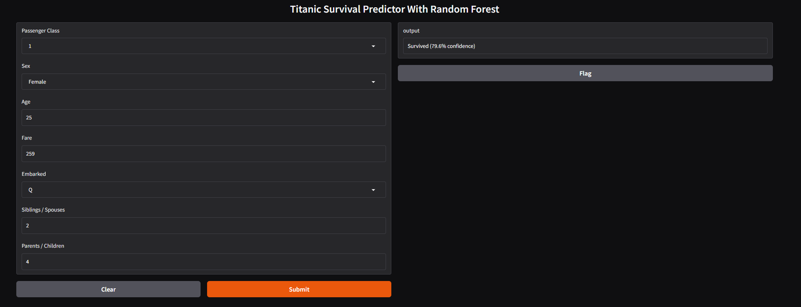

# Titanic Survivor Classifier

## Info

- Predicts passenger survival using a Random Forest classifier.

- Dataset: Kaggle Titanic `train.csv` (891 rows). Dropped `Cabin`, `Ticket`, and `Name`. Filled missing `Age` with median and `Embarked` with mode. Encoded `Sex`, one-hot encoded `Embarked`, and engineered `Family = SibSp + Parch + 1`.

- Result: Best model used 200 trees with `max_depth=5`, reaching 82% test accuracy and outperforming the previous Decision Tree by 3%. OOB error stabilised around 100 trees. `Fare`, `Sex`, and `Age` were among the most influential features. Includes a local Gradio app for interactive Titanic survival predictions.

- What I learned: Random Forest improves stability by averaging many trees instead of relying on one greedy model. Random feature sampling helps uncover useful predictors a single Decision Tree may overlook, while OOB scoring gives a useful built-in estimate of generalisation performance.

## Demo Screenshot

