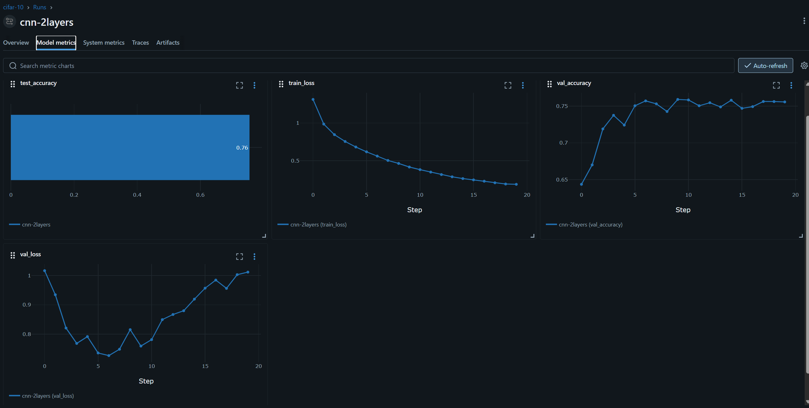

# CNN Image Classifier — CIFAR-10

A convolutional neural network trained on CIFAR-10, extended from the MNIST baseline to handle real RGB photos across 10 object classes. Builds on the same two-block Conv architecture, adding a hidden FC layer with Dropout and per-channel normalization.

---

## What it does

Classifies 32×32 color images into 10 categories: airplane, automobile, bird, cat, deer, dog, frog, horse, ship, truck. Input is a raw image, output is a predicted class and confidence score. This is the same problem shape as multi-class defect detection — the connection to the Defect Detector project is intentional.

---

## How it was built

**Architecture**

```
Input (3, 32, 32)
→ Conv2d(3→32, k=3, p=0) → BatchNorm2d → ReLU → MaxPool(2×2)   # (32, 15, 15)
→ Conv2d(32→64, k=3, p=0) → BatchNorm2d → ReLU → MaxPool(2×2)  # (64, 6, 6)
→ Flatten                                                         # 2304
→ Linear(2304, 512) → ReLU → Dropout(0.2)
→ Linear(512, 10)
```

No padding was used (padding=0), consistent with the MNIST baseline. Each Conv block uses BatchNorm before ReLU, which stabilizes training by normalizing activations before the non-linearity. Dropout(0.2) sits between the two FC layers to reduce co-adaptation of neurons.

**Key differences from the MNIST build**

- `in_channels=3` on Conv1 for RGB input vs grayscale
- Per-channel normalization: `mean=(0.4914, 0.4822, 0.4465)`, `std=(0.2023, 0.1994, 0.2010)` — MNIST used a single scalar
- Hidden FC layer added (512 units) before the output layer. The MNIST version went straight from Flatten to Linear(10)
- Flattened size is 2304 (64×6×6) vs 1600 (64×5×5) on MNIST due to larger spatial input

**Training config**

| Parameter | Value |
|---|---|
| Optimizer | Adam |
| Learning rate | 0.001 |
| Epochs | 20 |
| Batch size | 64 |
| Loss | CrossEntropyLoss |

---

## Results

**Final test accuracy: 75.57%**

| Epoch | Train Loss | Val Loss | Val Accuracy |
|---|---|---|---|
| 0 | 1.3134 | 1.0162 | 64.37% |
| 5 | 0.6173 | 0.7356 | 75.05% |
| 6 | 0.5605 | 0.7267 | 75.71% |
| 9 | 0.4154 | 0.7592 | 75.91% |
| 19 | 0.1856 | 1.0114 | 75.57% |



**Overfitting is clearly visible.** Val loss was lowest at epoch 6 (0.7267) and increased steadily through epoch 19 (1.0114) while train loss continued falling to 0.18. Val accuracy plateaued at ~75.5-76% from epoch 9 onward with no further improvement. The submitted model is the epoch-20 checkpoint, not the best checkpoint — no early stopping was implemented in this run. Best achievable val accuracy from this run was approximately 75.91% at epoch 9.

**Per-class analysis (confusion matrix)**

Strongest classes: truck (84.6%), ship (84.1%), frog (80.4%), horse (79.0%)

Weakest classes: cat (62.2%), bird (65.2%), dog (65.8%)

The hardest confusion pair is **cat ↔ dog**: 181 dogs were predicted as cats, 138 cats were predicted as dogs. This is expected — both are small animals with similar texture and color distributions at 32×32 resolution. Airplane/automobile/ship/truck benefit from distinctive shapes and backgrounds that are separable even at low resolution.

---

## What I learned

**What worked:** BatchNorm consistently stabilized training — loss curve was smooth from epoch 0 with no spikes. Dropout(0.2) provided some regularization but was not enough to prevent overfitting beyond epoch 6.

**What failed:** No early stopping meant the submitted model is not the best model from this run. A proper run would checkpoint at best val loss and reload that weight before evaluation.

**What I would do differently:**
- Add early stopping (stop if val loss does not improve for 3 epochs, reload best checkpoint)
- Try Dropout(0.5) — 0.2 was too light for a dataset this hard
- Add data augmentation (random horizontal flip, random crop) — CIFAR-10 benefits significantly from it
- Use a learning rate scheduler (StepLR or ReduceLROnPlateau) — flat LR of 0.001 for 20 epochs is crude

**Why accuracy is lower than MNIST (75% vs 99%):** CIFAR-10 is a fundamentally harder problem. MNIST digits differ in shape and stroke pattern, which is easy to separate with conv filters. CIFAR-10 classes share textures, colors, and backgrounds. A cat and a dog at 32×32 look nearly identical to a shallow CNN. This is not a failure of the architecture — it is the expected behaviour of a 2-block CNN on a dataset designed to require deeper models.

---

## Connection to downstream projects

This architecture is the foundation for the Manufacturing Defect Detector (Summer Weeks 3-5). The same Conv→BN→ReLU→Pool block structure, the same MLFlow logging pattern, and the same class imbalance considerations apply. CIFAR-10's cat/dog confusion at low resolution is the same problem as defect type confusion on similar-looking surface textures.
