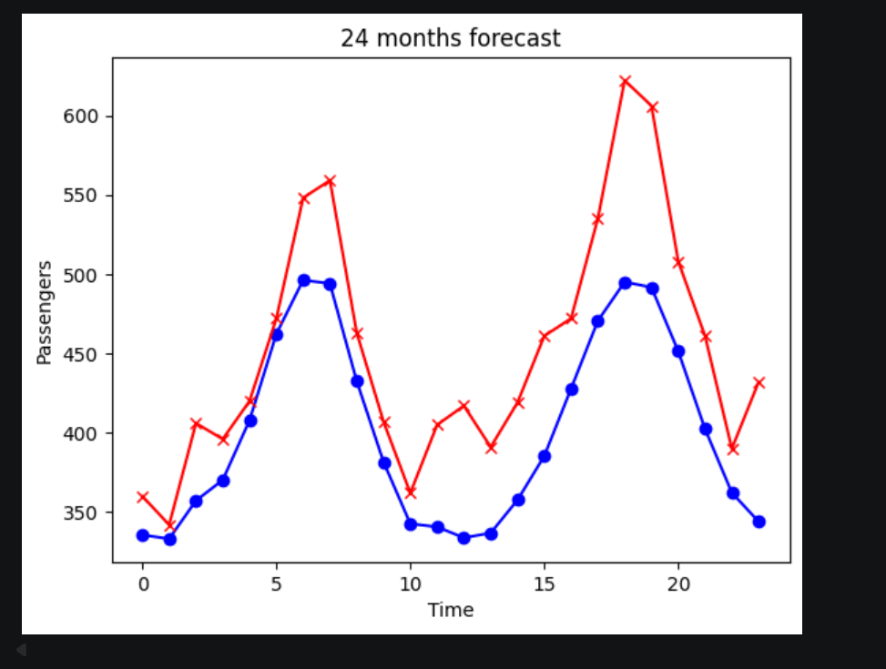

# PyTorch Long Short-Term Memory Neural Network on AirPassenger Dataset

## What does this project do?

An LSTM model that forecasts monthly airline passenger numbers 24 months forward using only historical data. Given 11 years of monthly observations (1949-1959), it learns seasonal patterns and predicts the following 2 years. Run the notebook and see predicted vs actual passenger counts on a single plot

## How was it built?

Dataset: Box-Jenkins airline passengers, 144 monthly observations 1949-1960.

Pipeline: Raw counts normalized to [0,1] with MinMaxScaler fitted on training data only (first 120 observations, test distribution never touches the scaler fit). Sliding window sequence creation: 12 consecutive months predict the 13th, producing 132 (input, target) pairs split at index 108. Model is nn.LSTM(input_size=1, hidden_size=50, num_layers=1, batch_first=True) feeding only the final time step hidden state into nn.Linear(50, 1). MSELoss, Adam lr=0.001, 1000 epochs. Evaluation uses a rolling autoregressive forecast where model predictions feed back as inputs for subsequent steps, simulating real deployment where ground truth is unavailable

## What is the result?

Test RMSE: 48.23 passengers on a range of 336-622 (roughly 10-13% average error).

The model captures the SHAPE (seasonality) but not the MAGNITUDE (trend). This is because the airline passenger data has an upward trend that the model hasn't fully captured - the training data goes up to ~420 at its highest, but the test data peaks at ~620.

## What did I learn?

Time series splits must be positional, never random. Shuffling destroys the sequential dependency the model is learning. The entire data pipeline is sequence construction from a single column, there are no separate feature columns. Rolling autoregressive forecasting compounds errors: each wrong prediction pollutes the next input window, which is why predictions drift further into the forecast horizon. LSTM cell state solves vanishing gradient through additive updates, the same structural logic as ResNet skip connections.