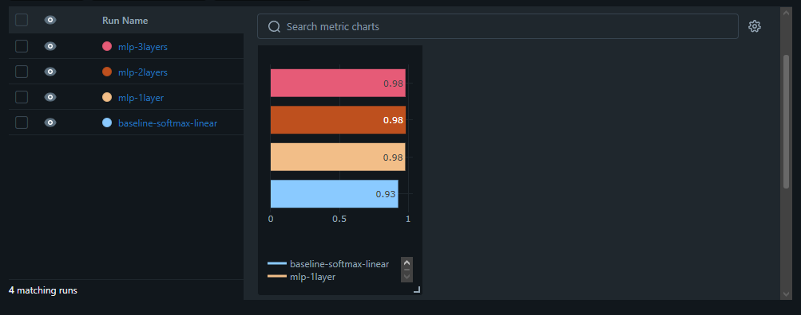

# PyTorch MLP — MNIST Depth Comparison

## What it does

Trains four variants of a fully-connected neural network on the MNIST handwritten digit dataset and compares their test accuracy. The goal is to empirically show how adding hidden layers improves performance up to a point, after which diminishing returns and mild overfitting set in. This motivates why CNNs with spatial structure outperform brute-force depth on image data.

## How it was built

Single dynamic model class (`ModelDynamicLayers`) that accepts a list of hidden sizes and builds the architecture automatically using `nn.Sequential`. Four variants trained under the same conditions (Adam lr=0.001, 20 epochs, batch size 64, CrossEntropyLoss):

| Run | Architecture | Test Accuracy |
|---|---|---|
| Baseline (linear softmax) | 784 → 10 | 92.74% |
| 1 hidden layer | 784 → 256 → 10 | 97.89% |
| 2 hidden layers | 784 → 256 → 128 → 10 | 98.29% |
| 3 hidden layers | 784 → 256 → 128 → 64 → 10 | 98.04% |

All runs logged with MLFlow for side-by-side comparison.

## The result

Best architecture: 2 hidden layers at 98.29%. The first hidden layer gives the largest gain (+5.15%). The second adds +0.40%. The third actually drops 0.25% — mild overfitting on a dataset simple enough that deep abstraction is unnecessary. MNIST does not need 3 layers of feature extraction; CIFAR-10 will.

**Key insight:** without activation functions, stacking linear layers collapses into a single linear transformation (W3·W2·W1·x = W_combined·x). ReLU between layers prevents this collapse by creating different active neuron subsets per input region, making the network a piecewise linear function with real expressiveness.

## What I learned

Adding depth is not free. The 3-layer model has 235,146 parameters learning pixel combinations on 28×28 greyscale images with clean backgrounds and centered digits. The dataset is too simple to justify that capacity. The performance drop from layer 2 to layer 3 is a concrete example of the bias-variance tradeoff: more parameters, same data, slightly worse generalization.

The MLP's fundamental limitation — treating every pixel independently with no spatial awareness — is what this build exposes. The 2/8 and 5/3 confusion pairs that appeared in the softmax baseline persist here because hidden layers learn pixel combination patterns but still have no concept of locality. A Conv2d layer looking at 3×3 patches fixes this directly. That is the CNN's motivation.
